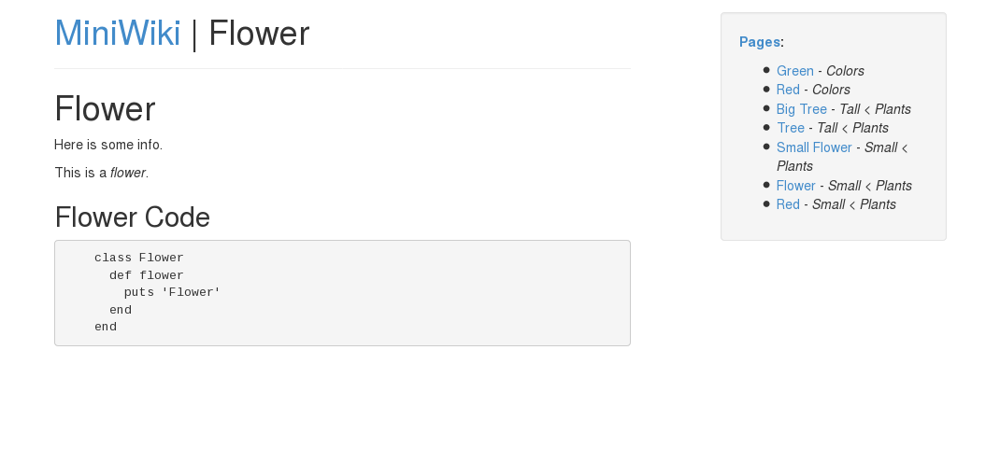
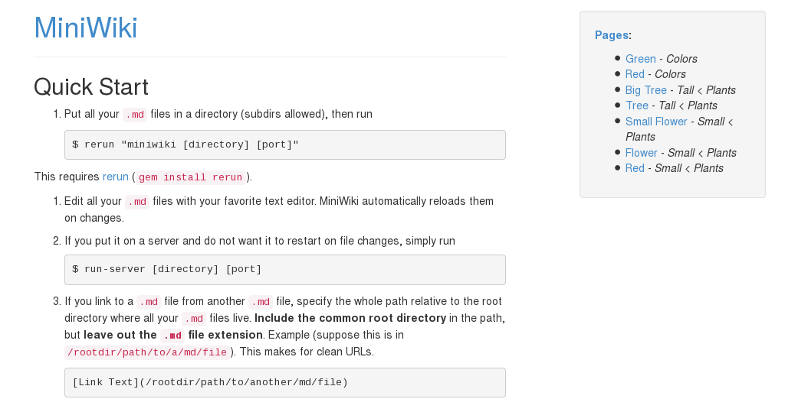

# MiniWiki

This is a minimalist Markdown wiki.

- It uses Markdown.
- The Markdown files can be organized in an arbitrary directory hierarchy (see `miniWiki/`).
- It serves static files (images, PDFs, audio files, videos, ...).
- It allows linking between wiki pages.

This is how you use it:

```
$ ./run [directory] [port]
```

This will update wiki pages in `[directory]` upon reload whenever their Markdown source file changes, allowing you to edit your wiki with your favorite text editor. You could even use a "cloud-based" editor running in your browser that connects to a server running MediaWiki to have a fully-in-browser wiki.

However, if you wish not to reload on file changes and just serve your wiki from a server, run:

```
$ ./run-server [directory] [port]
```

Side note: All of MiniWiki's actual source code lives in one single, small file, `app.rb`. This, theoretically, allows you to just drop the file into any directory on a server running Ruby and run `ruby app.rb [directory] [port]`.

MiniWiki depends on `sinatra`.

----------

**A Wiki Page**



**The Quick Start Page**


